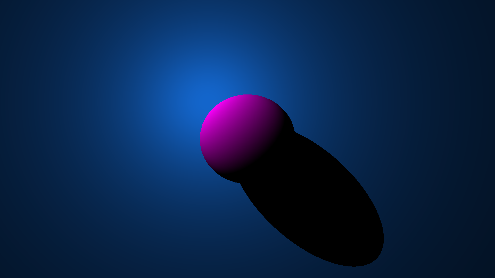

# JavaRayTracing
Third Year project for my computer science bachelor’s degree. Aim of the system was to implement a program that can render complex objects made of triangle meshes, Due to the time constraints of the project it was not fully finished. Issues with the triangle rendering still exist coming from either the Camera class or Inside-out tests.
Current build can render simple geometry like so:
 
This project was implemented solely in Java. This language was chosen as I am familiar with the language. C++ would have been a good alternative due to the speed requirements need when rendering. This project pushed my maths skills and required significant planning before writing any code. The maths and complex nature taught me a lot about the development process and if I were to do this project again, I would spend more time planning the structure. For example, the Scene class was unplanned for and implemented to solve problems not thought of during planning. 

### To Finish:
* Triangle intersections
* Inverse square law for lights
* JavaDoc
